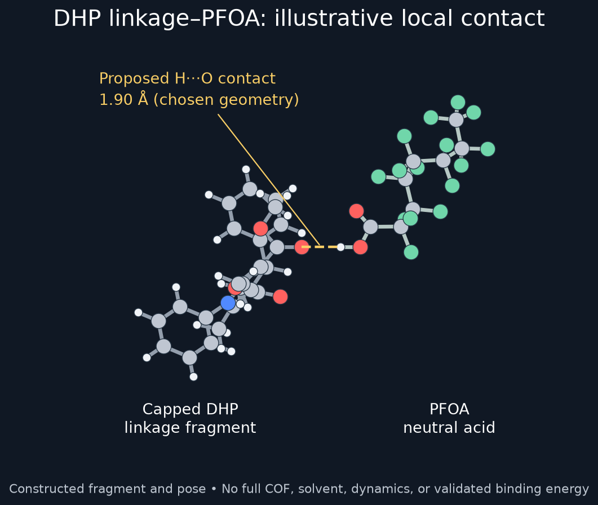

# Molecular visualizations

Download this repository using **Code → Download ZIP**, then unzip it. In VMD Main choose **File → Load Visualization State** and select either:

- `all-pfas/view_all_pfas.vmd`: seven neutral PFAS parent-acid conformers.
- `dhp-pfoa-contact/view_contact.vmd`: illustrative capped DHP-linkage fragment and neutral PFOA contact.

The states embed their coordinates, so they work from any folder. Each also has standalone molecular files and source notes. Loading a scene hides previously displayed molecules without deleting them.

The contact has a deliberately chosen H···O distance of 1.90 Å. It is not a full periodic DHP-COF-3 structure, a validated binding pose, or an MD result. The fragment is based on the main-paper scheme; supplementary crystallographic coordinates were unavailable. See the contact folder for the exact assumptions.
